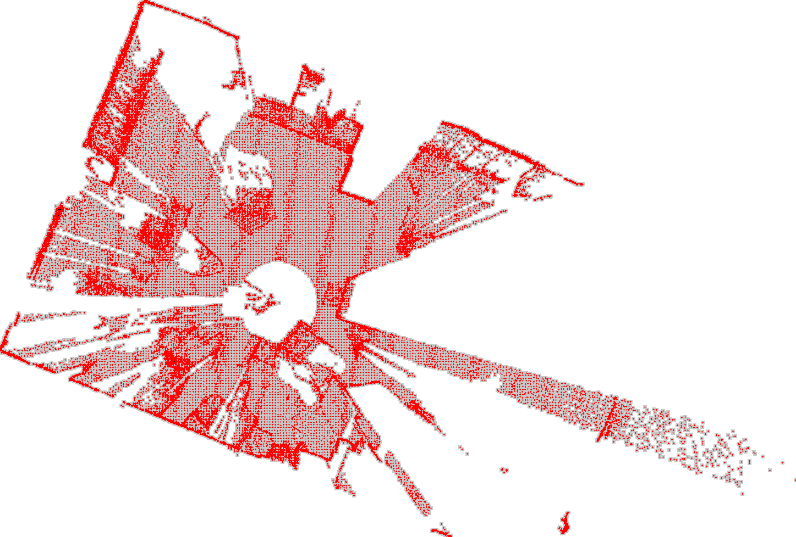
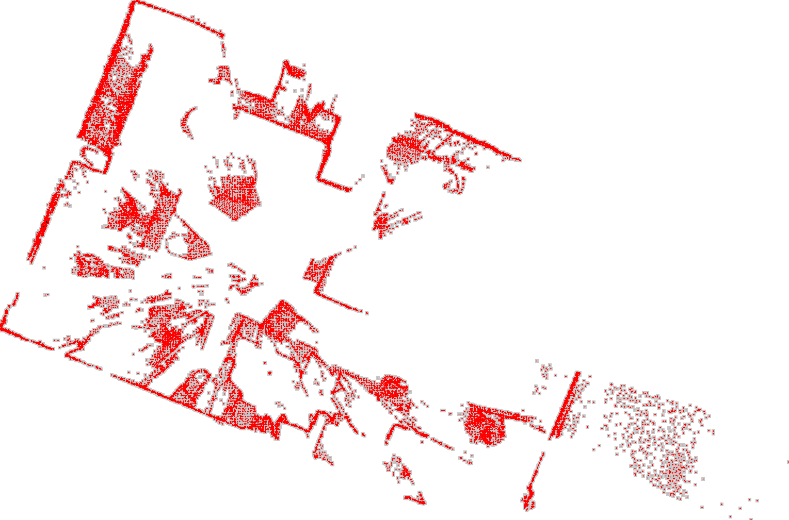

# LiDAR 2D Room Mapping

This project uses a LiDAR sensor to create 2D maps of indoor environments. It processes point cloud data to generate top-down views of rooms, highlighting objects and open spaces.

## Features

- Point cloud processing using PCL (Point Cloud Library)
- Floor plane detection and removal
- 2D map generation with object outlines

## Floor Plane Removal

One of the key features of this project is its ability to detect and remove the floor plane from the point cloud data. This is achieved through the following steps:

1. **Plane Segmentation**: The RANSAC (Random Sample Consensus) algorithm is used to detect the dominant plane in the point cloud, which is typically the floor in indoor environments.

2. **Angle-Based Filtering**: The detected plane is checked against a vertical angle threshold. This ensures that only nearly-horizontal planes are considered as potential floors, preventing walls or other vertical surfaces from being mistakenly removed.

3. **Point Cloud Filtering**: If a floor plane is detected and confirmed, all points belonging to this plane are removed from the point cloud.

This floor removal process significantly improves the clarity of the resulting 2D map by focusing on vertical structures and objects in the room, rather than the floor surface.

## Output Images

